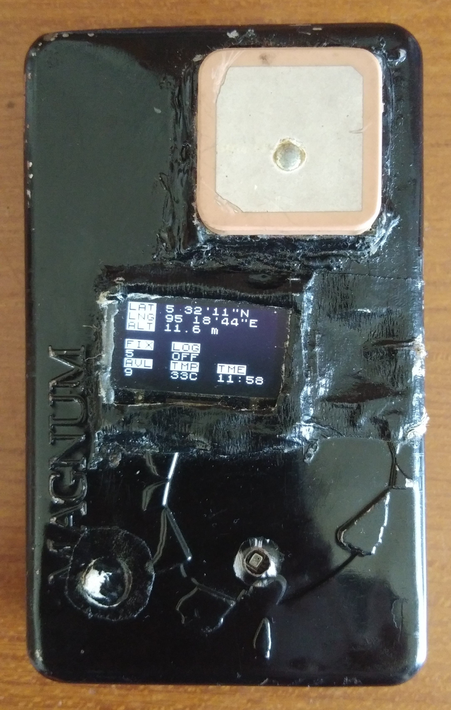
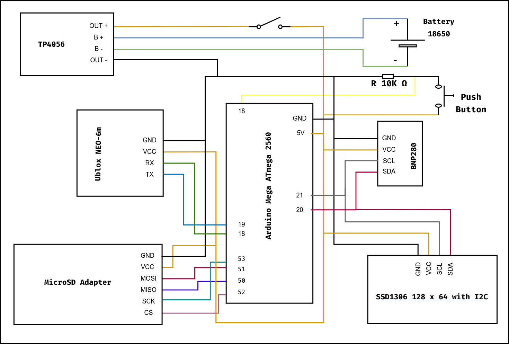

<!-- PROJECT SHIELDS -->
[![Contributors][contributors-shield]][contributors-url]
[![Forks][forks-shield]][forks-url]
[![Stargazers][stars-shield]][stars-url]
[![Issues][issues-shield]][issues-url]
[![MIT License][license-shield]][license-url]

<!-- PROJECT LOGO -->
<br />
<p align="center">
  <a href="https://github.com/apiz19/minigpsplus">
    
  </a>

  <h3 align="center">MiniGPS+</h3>

  <p align="center">
    Alternatif <em>Global Positioning System</em> (GPS) komersial untuk kebutuhan praktik navigasi darat
    <br />
    <a href="https://github.com/apiz19/minigpsplus"><strong>Baca dokumentasi »</strong></a>
    <br />
    <br />
    <a href="https://github.com/apiz19/minigpsplus">Lihat demo</a>
    ·
    <a href="https://github.com/apiz19/minigpsplus/issues">Laporkan masalah</a>
    ·
    <a href="https://github.com/apiz19/minigpsplus/issues">Saran ide</a>
  </p>
</p>

<!-- TABLE OF CONTENTS -->
<details open="open">
  <summary><h2 style="display: inline-block">Daftar isi</h2></summary>
  <ol>
    <li>
      <a href="#latar-belakang">Tetang MiniGPS+</a>
      <ul>
        <li><a href="#fitur">Fitur Utama</a></li>
      </ul>
    </li>
    <li>
      <a href="#langkah-awal">Langkah Awal</a>
      <ul>
        <li><a href="#alat-dan-bahan">Alat dan Bahan</a></li>
        <li><a href="#library">Library</a></li>
        <li><a href="#yang-diperlukan">Yang Diperlukan</a></li>
      </ul>
    </li>
     <li><a href="#penggunaan">Penggunaan</a></li>
     <ul>
        <li><a href="#instalasi-program">Instalasi Program</a></li>
        <li><a href="#olah-data">Olah Data</a></li>
     </ul>
    <li><a href="#kontribusi">Kontribusi</a></li>
    <li><a href="#lisensi">Lisensi</a></li>
    <li><a href="#kontak">Kontak</a></li>
  </ol>
</details>

<!-- ABOUT THE PROJECT -->
## Latar belakang

<p align="center">
  <a href="https://github.com/apiz19/minigpsplus">
    
  </a>

Proyek ini merupakan hasil akhir penelitian tugas akhir saya sebagai mahasiswa
di Jurusan Teknik Elektro dan Komputer Universitas Syiah Kuala, Aceh. Ide
membangun purwarupa ini muncul setelah melihat tren yang berkembang di kalangan
muda penggemar kegiatan petualagan di alam bebas. Saya melihat, masifnya
perkembangan ini tidak dibarengi dengan kesadaran akan pentingnya pengetahuan
dasar sebelum berkegiatan di alam bebas yang tentunya akan sangat beresiko bagi
subjek (pendaki).

Salah satu pengetahuan dasar yang sangat penting tetapi kerap diabaikan adalah
kemampuan membaca peta, menentukan posisi pada medan terbuka atau tertutup, dan
menentukan arah pergerakan selama berada di gunung hutan. Umumnya teori ini
dapat dipelajari sebagai ilmu terapan [navigasi
darat](https://id.wikipedia.org/wiki/Navigasi_darat). Dalam realitas yang Saya
amati, khususnya pada komunitas pendaki di Aceh, GPS masih menjadi alat yang
cukup ekslusif di kalangan pelajar karena harganya masih tergolong mahal.
Padahal, fungsinya sangat penting dalam proses praktik navigasi darat di gunung
hutan.

Purwarupa MiniGPS+ hadir bukan sebagai solusi, tetapi sebagai alternatif.
Perbandingan yang dilakukan terhadap _receiver_ [Garmin Oregon
650](https://buy.garmin.com/en-US/US/p/113520) menunjukkan bahwa efektifitas
MiniGPS+ masih kalah, meskipun hasil perbandingannya tidak terlalu signifikan.
Perbandingan selengkapnya dapat dilihat pada [Paper MGP](link_paper).

### Fitur

* Merekam trek
* Menampilkan titik koordinat
* Menampilkan elevasi
* Menampilkan pembacaan suhu
* Menampilkan informasi satelit

<!-- GETTING STARTED -->
## Langkah awal

### Alat dan Bahan

* [Arduino "ATMega2650" Mega Pro Mini](https://robotdyn.com/mega-2560-pro-embed-ch340g-atmega2560-16au.html) x 1
* [Ublox NEO-6M](https://www.u-blox.com/en/product/neo-6-series)
* [Pressure Sensor BMP280](https://www.bosch-sensortec.com/products/environmental-sensors/pressure-sensors/bmp280/) x 1
* [module MicroSD Card](https://create.arduino.cc/projecthub/electropeak/sd-card-module-with-arduino-how-to-read-write-data-37f390) x 1
* [module SSD1306 OLED 128x64 I2C Display](https://www.instructables.com/Arduino-and-the-SSD1306-OLED-I2C-128x64-Display/) x 1
* [module Charging TP4056](https://www.best-microcontroller-projects.com/tp4056.html) x 1
* Battery Li-ion 18650 x 1
* Push button x 1
* Resistor 10k x 1
* MicroSD >= 2 gb x 1

### Library

* [NeoGPS](https://github.com/SlashDevin/NeoGPS) -- integrasi Ublox NEO-6M
* [Adafruit BMP280](https://github.com/adafruit/Adafruit_BMP280_Library) -- integrasi BMP280
* [U8g2](https://github.com/olikraus/u8g2) -- integrasi SSD1306, layout display
* [SD](https://www.arduino.cc/en/Reference/SD) -- integrasi module MicroSD

### Yang diperlukan
  
<details open="open">
  <summary>Skema rangkaian</summary>
  <p align="center">
    
    </br>
    Rangkaian MiniGPS+
  </a>
</details>

- Pastikan semua komponen kelistrikan terhubung seperti skema di atas
- [Arduino IDE / `arduino-cli`](https://www.arduino.cc/en/Main/Software_)
- :coffee:

<!-- USAGE EXAMPLES -->
## Penggunaan

### Instalasi Program

1. Kloning repositori ini

   ```sh
   git clone https://github.com/apiz19/minigpsplus.git
   ```

2. Salin :file_folder: `libraries` dan `minigpsplus` ke :open_file_folder: default _project_ Arduino IDE. Di Linux `$HOME/Arduino/di-sini`.

```sh
cd minigpsplus
cp -r libraries minigpsplus $HOME/Arduino/
```

3. Buka file `minigpsplus.ino` dengan IDE Arduino atau text editor favorit Anda
4. Compile & Upload

> Jika menggunakan [`arduino-cli`](https://arduino.github.io/arduino-cli/latest/)

```sh
arduino-cli compile --fqbn arduino:avr:mega minigpsplus.ino
arduino-cli upload -p /dev/ttyUSB0 --fqbn arduino:avr:mega minigpsplus.ino
```

Jika proses kompilasi dan upload sukses, Anda sudah punya GPS sendiri, selamat menejalah :earth_asia: :ear_of_rice:

### Olah data

> TODO: more detail

- on/off rekam trek denga push button
- konversi `csv` menjadi `gpx` dilakukan dengan tools ini [csv2gpx-tracks](https://git.io/csv2gpx-tracks)

<!-- CONTRIBUTING -->
## Kontribusi

Proyek ini masih banyak sekali kekurangan, jika Anda punya ide atau
saran perbaikan, saya akan dengan senang hati menanggapi :v:

1. Fork the Project
2. Create your Feature Branch (`git checkout -b feature/AmazingFeature`)
3. Commit your Changes (`git commit -m 'Add some AmazingFeature'`)
4. Push to the Branch (`git push origin feature/AmazingFeature`)
5. Open a Pull Request


<!-- LICENSE -->
## Lisensi

<p align="left">
    
    </br>
Didistribusikan di bawah lisensi <a href="http://creativecommons.org/licenses/by-nc-sa/4.0/">Attribution-NonCommercial-ShareAlike 4.0 International</a>
  </a>

<!-- CONTACT -->
## Kontak

Hafiz C. - [@kopishitam](https://twitter.com/kopishitam) - kopishitam@disroot.org

Project Link: [https://github.com/apiz19/minigpsplus](https://github.com/apiz19/minigpsplus)

<!-- MARKDOWN LINKS & IMAGES -->
<!-- https://www.markdownguide.org/basic-syntax/#reference-style-links -->
[contributors-shield]: https://img.shields.io/github/contributors/apiz19/minigpsplus.svg?style=for-the-badge
[contributors-url]: https://github.com/apiz19/minigpsplus/graphs/contributors
[forks-shield]: https://img.shields.io/github/forks/apiz19/minigpsplus.svg?style=for-the-badge
[forks-url]: https://github.com/apiz19/minigpsplus/network/members
[stars-shield]: https://img.shields.io/github/stars/apiz19/minigpsplus.svg?style=for-the-badge
[stars-url]: https://github.com/apiz19/minigpsplus/stargazers
[issues-shield]: https://img.shields.io/github/issues/apiz19/minigpsplus.svg?style=for-the-badge
[issues-url]: https://github.com/apiz19/minigpsplus/issues
[license-shield]: https://img.shields.io/badge/License-CC%20BY--NC--SA%204.0-lightgrey.svg?style=for-the-badge
[license-url]: http://creativecommons.org/licenses/by-nc-sa/4.0/
[linkedin-shield]: https://img.shields.io/badge/-LinkedIn-black.svg?style=for-the-badge&logo=linkedin&colorB=555
[linkedin-url]: https://www.linkedin.com/in/hafiz-chairy-558b96175/
